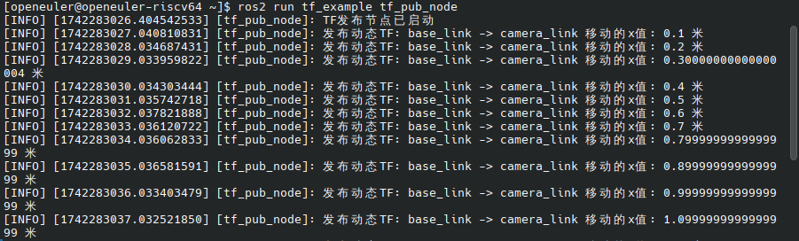
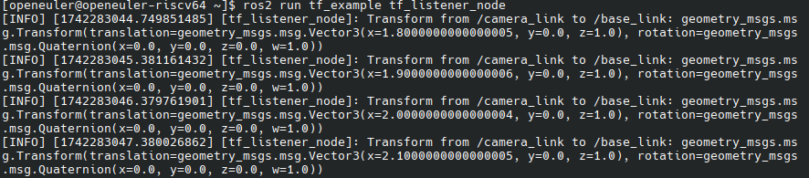
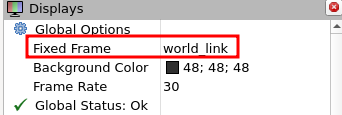
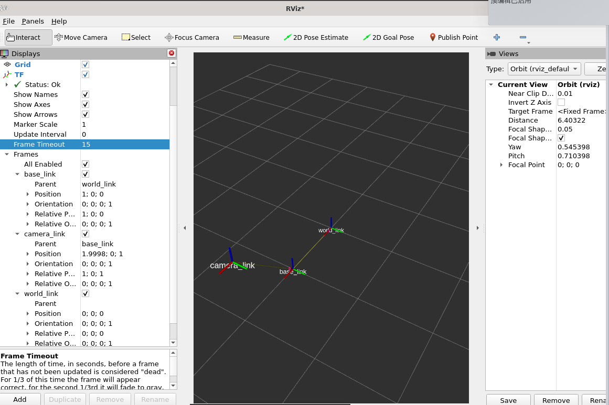
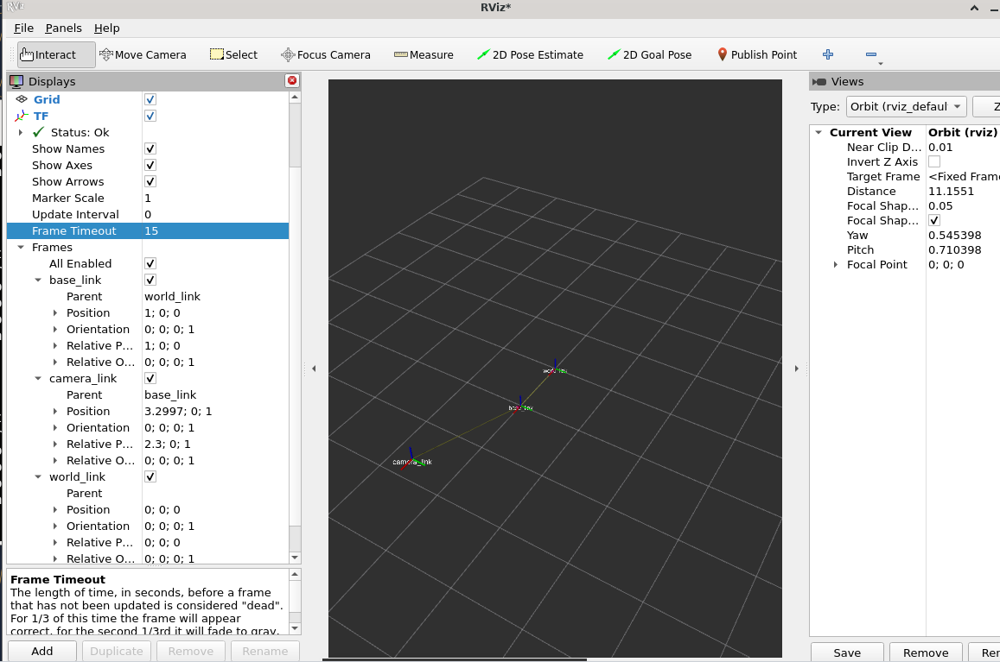

# ros_basic_programming_test

## test02

- 新建功能包，编写第一个ROS节点实现TF发布功能：发布/world_link到/base_link的静态TF（可自定义）以及/base_link到/camera_link的动态TF（可自定义）
- 编写第二个ROS节点实现TF监听功能：监听/camera_link到/base_link的动态TF并在终端打印输出
- 启动rviz查看TF的实时变化

## 实现过程

### 1 创建工作空间

```bash
# 创建工作空间
mkdir -p ~/ros2_ws/src
cd ~/ros2_ws/src
# 初始化工作空间
colcon build
echo "source ~/ros2_ws/install/setup.bash" >> ~/.bashrc
source ~/.zshrc
```

### 2 创建功能包

```bash
cd ~/ros2_ws/src
ros2 pkg create --build-type ament_python tf_example
```

​	`--build-type ament_python` 使用python作为开发语言

### 3 编写代码

#### 3.1 发布节点

 ```bash
 cd tf_example/tf_example/
 vim publish_tf.py
 ```

1. 初始化节点及TF广播器
2. 设置静态TF变换
3. 设置动态TF变换

```python
class TFPubNode(Node):
    def __init__(self):
        super().__init__('tf_pub_node')    # 节点名为tf_pub_node

        # 创建TF广播器
        self.tf_broadcaster = tf2_ros.TransformBroadcaster(self) # TransformBroadcaster对象,用于将TF变换广播到ROS网络中

        # 定时发布TF 1秒发布一次 
        self.timer = self.create_timer(1.0, self.publish_transform)
        # 初始化时间变量（以秒为单位）
        self.time_elapsed = 0.0
        # 初始化TF变换
        self.static_transform = geometry_msgs.msg.TransformStamped()
        self.static_transform.header.frame_id = 'world_link'    # 设置变换的参考坐标系（父坐标系）
        self.static_transform.child_frame_id = 'base_link'      # 设置目标坐标系（子坐标系）

        # 设置静态变换  这里是沿着x轴平移1米 
        # 方向角和四元数部分值为0的可以省略不写，默认值为0,此处写上为了自己看得懂
        self.static_transform.transform.translation.x = 1.0
        self.static_transform.transform.translation.y = 0.0
        self.static_transform.transform.translation.z = 0.0
        self.static_transform.transform.rotation.x = 0.0
        self.static_transform.transform.rotation.y = 0.0
        self.static_transform.transform.rotation.z = 0.0
        self.static_transform.transform.rotation.w = 1.0

        self.get_logger().info('TF发布节点已启动')

    def publish_transform(self):
        # 发布静态TF
        self.static_transform.header.stamp = self.get_clock().now().to_msg() # 更新时间戳
        self.tf_broadcaster.sendTransform(self.static_transform) # 发布world_link和base_link到ros网络

        # 发布动态TF
        # 同__init__
        self.time_elapsed += 0.1
        dynamic_transform = geometry_msgs.msg.TransformStamped()
        dynamic_transform.header.frame_id = 'base_link'
        dynamic_transform.child_frame_id = 'camera_link'
        dynamic_transform.transform.translation.x = self.time_elapsed
        dynamic_transform.transform.translation.y = 0.0
        dynamic_transform.transform.translation.z = 1.0
        dynamic_transform.transform.rotation.x = 0.0
        dynamic_transform.transform.rotation.y = 0.0
        dynamic_transform.transform.rotation.z = 0.0
        dynamic_transform.transform.rotation.w = 1.0

        dynamic_transform.header.stamp = self.get_clock().now().to_msg()
        self.tf_broadcaster.sendTransform(dynamic_transform)

        self.get_logger().info(f'发布动态TF: {dynamic_transform.header.frame_id} -> {dynamic_transform.child_frame_id} 移动的x值: {dynamic_transform.transform.translation.x} 米')
```

#### 3.2 监听节点

```bash
vim listen_tf.py
```

1. 初始化节点和监听器
2. 定时监听

```python
class TFListenerNode(Node):
    def __init__(self):
        super().__init__('tf_listener_node')

        # 创建TF监听器
        self.tf_buffer = tf2_ros.Buffer() # 缓存对象，存储tf变换信息
        self.tf_listener = tf2_ros.TransformListener(self.tf_buffer, self)  # 接受变换信息存入buffer

        # 定时器，每1秒获取一次TF信息
        self.timer = self.create_timer(1.0, self.listen_transform)

    def listen_transform(self):
        try:
            # 获取动态TF /camera_link到/base_link
            # 缓冲区中查找变换关系，base_link:目标坐标系 camera_link:源坐标系
            transform = self.tf_buffer.lookup_transform('base_link', 'camera_link', rclpy.time.Time())   
            # 打印信息
            self.get_logger().info(f'Transform from /camera_link to /base_link: {transform.transform}')
        except tf2_ros.TransformException as e:
            self.get_logger().warn(f'无法获取TF变换: {e}')
```

### 4 编译

```bash
cd ~/ros2_ws
colcon build
source ~/.bashrc
```

## 运行结果

### 发布节点

```bash
ros2 run tf_example tf_pub_node
```

运行结果如下图：



### 监听节点

```bash
ros2 run tf_example tf_listen_node
```

运行结果如下图：



### rviz查看实时变化

``` bash
ros2 run rviz2 rviz2
```

打开rviz2后，点击add按钮，选择tf。同时Global Options下的Fixed Frame选项选择world link。



展开tf选项，选择Show Names便于观察，运行结果如下图：





