# OBS

# OBS介绍

## 什么是 OpenBuildService?

- Open Build Service (OBS) 是一个用于自动化构建、发布和维护软件包的开源平台。它支持多种Linux发行版，允许开发者在不同架构和操作系统上构建、测试和发布软件包。OBS 提供了一个集成的环境，开发者可以在其中管理源代码、定义构建任务，并生成适用于多种目标平台的二进制包。
- OBS 的主要功能包括：
  - 多平台支持
  - 自动化构建
  - 版本控制集成
  - 访问控制和协作
  - 软件仓库管理

## OpenBuildService 的核心概念

- Project (项目): 包含一组相关的软件包和构建配置。
- Package (软件包): 包含源代码，构建脚本 (Spec 文件) 和其它资源。
- Repository (软件仓库): 存储和分发已构建二进制包的地方。
- Build Target (构建目标): 指定了软件包要构建的目标平台。
- Build Service (构建服务): 自动化执行软件包的编译、测试和生成包的过程。
- Source Service (源码服务): 处理和管理源代码的导入、转换和打包操作。
- Linked Package (链接包): 可以继承和复用其它项目的构建配置和依赖。

## More about OpenBuildService

- Project Config (工程配置): 定义了构建环境、编译器选项、宏定义和其他构建参数。
- Project Meta (工程 Metadata): 包含项目的基本信息和元数据。
- Package Meta (包 Metadata): 包含每个软件包的相关元数据。

## OpenBuildService的组成

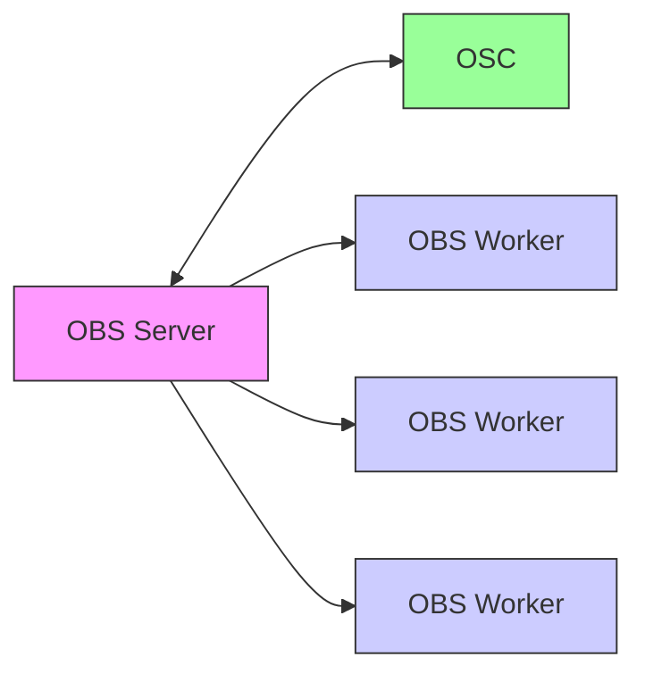

# openEuler obs介绍

## 注册

openEuler obs网址：https://build.tarsier-infra.isrc.ac.cn/
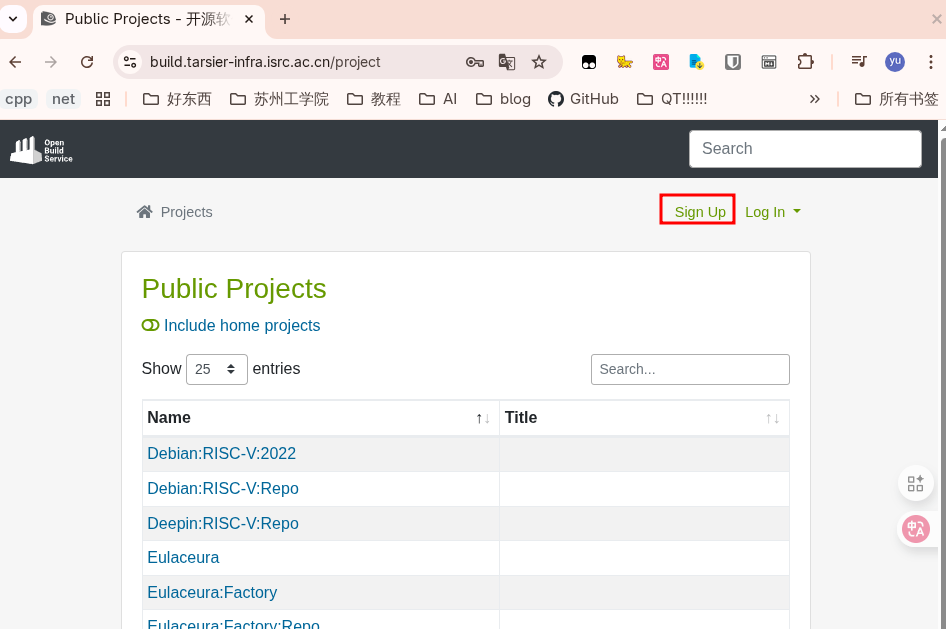
点击右上角sign up注册账号，后登录。

## 项目

以openEuler:24.03为例：

### overview

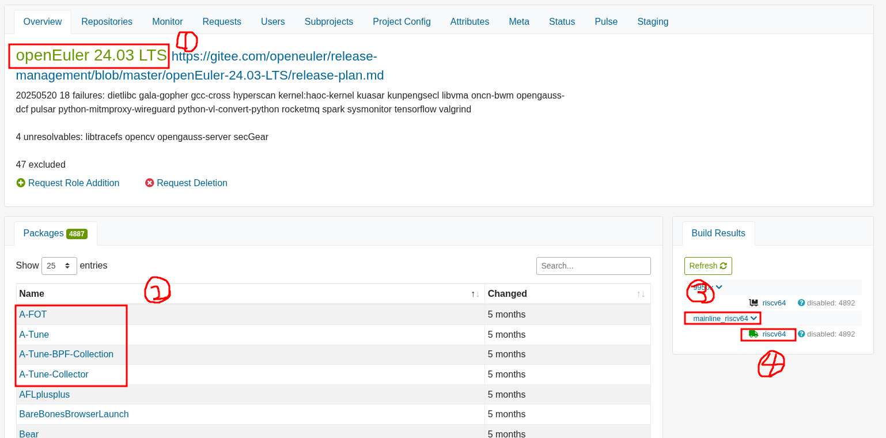

1. 工程名
2. 工程内的包
3. 仓库名
4. 编译出来的架构

### Meta

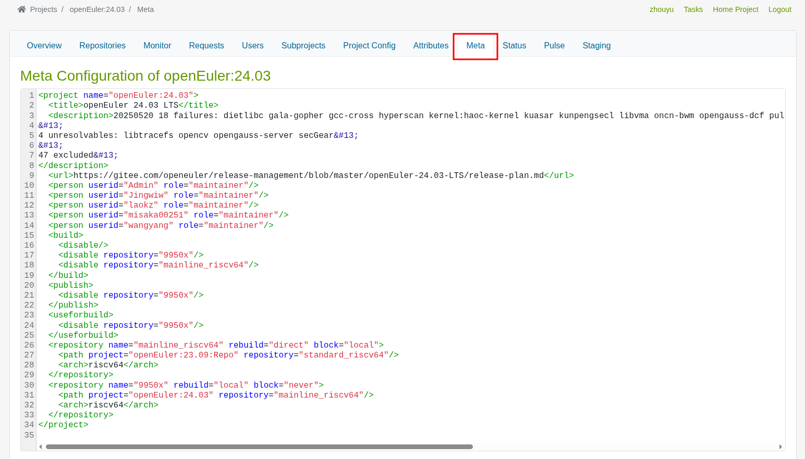
点击上方meta选项卡，可以看到工程的meta data 文件。

- **作用**：`Meta` 文件定义了项目的**结构和基本信息**，也就是“关于项目本身的数据”。它比 `Project Config` 更侧重于组织关系和权限。
- **内容**：基于XML格式的文本编辑器，主要定义以下内容：
  - `<title>` 和 `<description>`：项目的标题和详细描述。
  - `<person>`：定义项目中的**用户角色和权限**。例如，谁可以维护这个项目（`role="maintainer"`），谁是bug负责人（`role="bugowner"`）。
  - `<repository>`：定义项目的**构建目标**。这是`Meta`文件最重要的部分之一。它告诉 OBS：“我的这个项目，需要在哪个操作系统/架构上进行构建？”
    - 例如，`<repository name="openSUSE_Leap_15.5">` 表示为 openSUSE Leap 15.5 创建一个构建目标。
    - `<path project="openSUSE:Leap:15.5" repository="standard"/>` 表示构建所需的基础包来自 `openSUSE:Leap:15.5` 项目的 `standard` 仓库。
  - `<build>` / `<publish>` / `<debuginfo>`：全局控制构建、发布、调试信息的生成。
  - `<link>`：定义此项目是否链接（`link`）了另一个项目。这用于创建派生项目，例如 `MyProject:Branch` 链接到 `openSUSE:Factory`，表示你的项目基于 `openSUSE:Factory`

### Project Config


- **作用**：项目的核心配置文件。它定义了整个项目如何运作的规则和策略。
- **内容**：基于XML格式，通常是一些简单的键值对或指令。常见的配置项包括：
  - `%define` 宏：定义全局宏，比如设置发布版本号、编译器选项等。例如：`%define _with_foo 1` 会在这个项目的所有包中生效。
  - `Preinstall` / `Conflict`：定义在安装这个项目中的任何包之前，系统必须预装哪些包，或者不能和哪些包共存。
  - **构建策略**
  - **签名**：配置项目发布的软件包是否需要数字签名，以及如何签名。
  - **宏覆盖**：覆盖 RPM 构建时的默认宏。

### Repositories

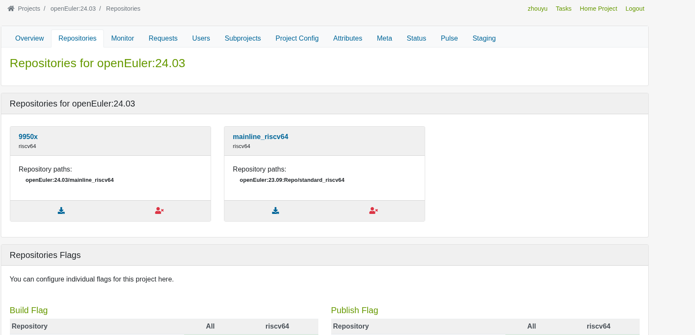

- **作用**：这个选项卡提供了一个**图形化界面**来管理 `Meta` 文件中定义的构建目标。
- **内容**：
  - 以表格形式展示所有为项目定义的仓库（如 `openSUSE_Tumbleweed`, `Ubuntu_22.04` 等）。
  - 显示每个仓库对应的架构（如 `x86_64`, `i586`, `aarch64`）。
  - 显示仓库的路径（即它从哪里获取基础包）。
  - 通常你可以直接在这里**添加**或**删除**仓库，OBS会自动修改背后的 `Meta` 文件。

## 流程

### 修包

1. 登录OBS后进入All Projects
    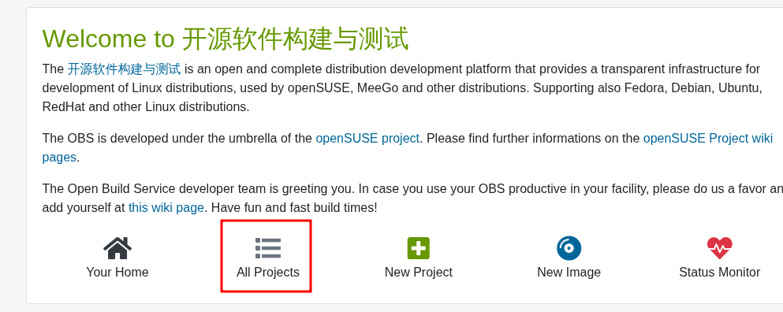
    
2. 找到工程，进入工程详细界面；

3. 点击软件包进入软件包详情界面
    假设我要修which包：
    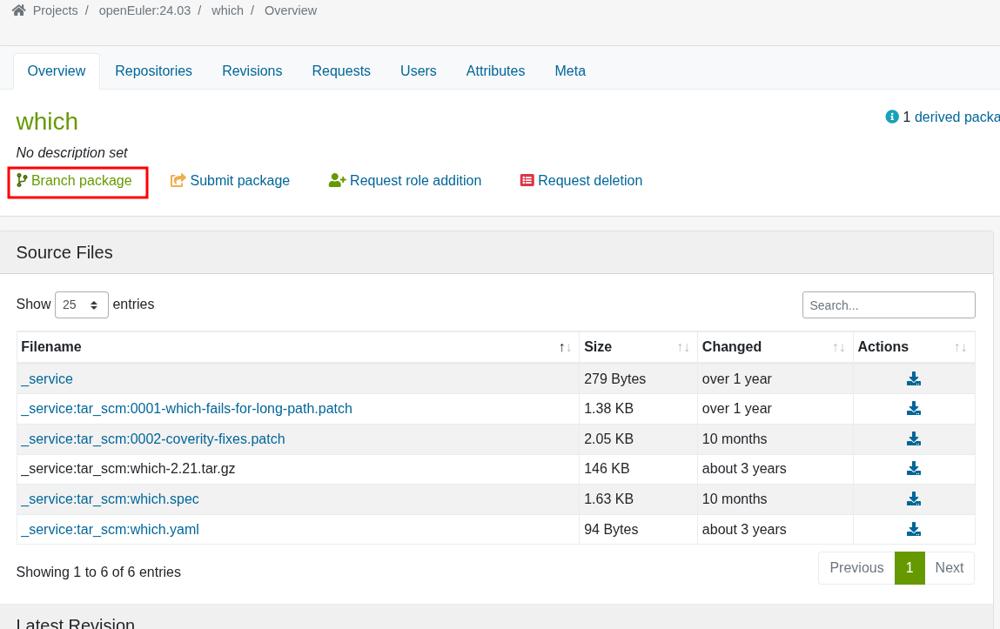
    点击Branch package按钮
    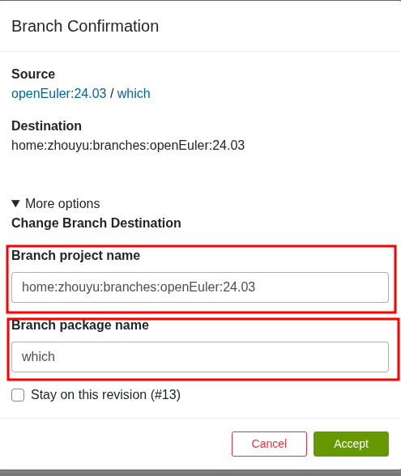
    
    
    
    点击accpet在家目录创建子工程；也可以在自定义子工程名以及包名，Branch package name可以随意修改，不会影响最终生成的软件包名；Branch project name不能随意自定义， 默认为：`home:<你的用户名>:branches:<源项目名称>`；
    
4. branch后
    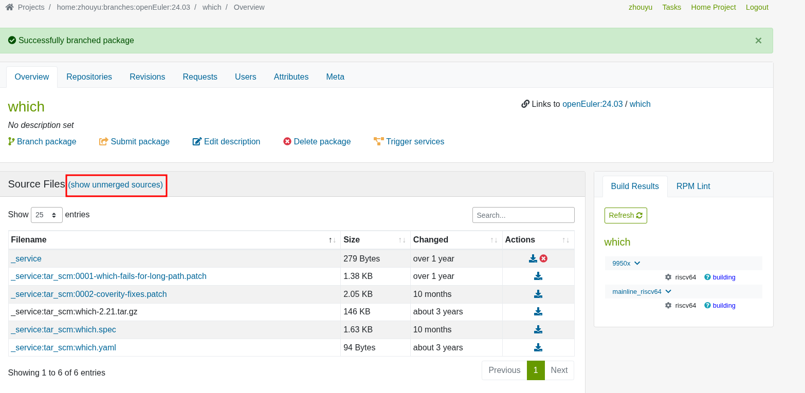
    点击红框内的`show unmerged sources`链接：
    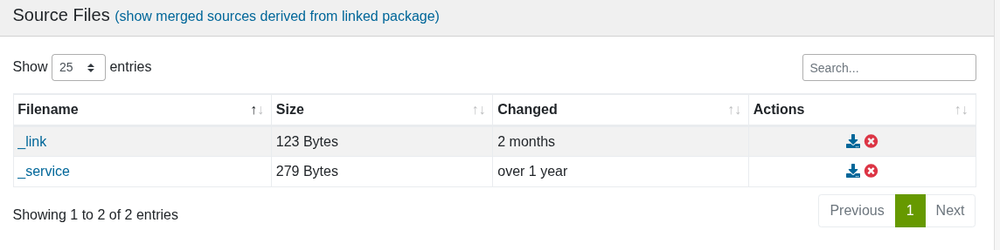
    1. `_link`
        `_link`文件可以让我们在多个项目或包之间共享代码，无须手动复制或维护多个副本，当源码更新时，连接到该源包的包都会自动更新；
        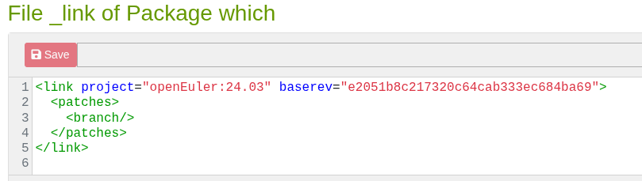
        `<link project="..." package="...">`：`project`：指定源包所在的项目名。`package`：指定源包的包名。- `<patches>...</patches>`： 可选,允许在链接到上游源码的同时，应用你自己的本地修改。
        **我们的工作流不需要，删掉文件即可；**
    2. `_service`
        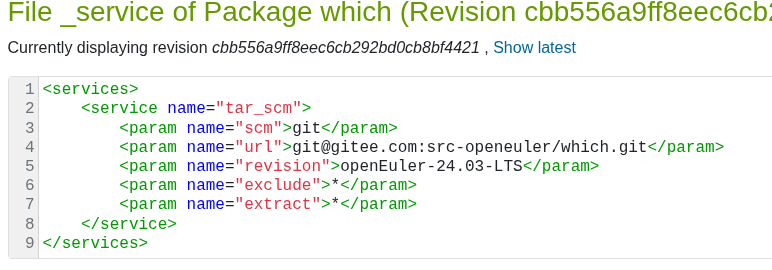
        `<service name="..." mode="...">`
        `name`：指定要运行的 OBS 服务器的**内置脚本名字**。常用的有`tar_scm`：用于 Git/SVN/HG 等版本控制系统的检出和打包。 `download_url`：从指定 URL 下载单个文件。
        `<param name="..."">`：每个服务都有一套自己的参数。对于 `tar_scm`：`url`：版本控制库的地址；`scm`：版本控制系统类型，如 `git`, `svn`, `；`revision`：要检出的版本，可以是分支名、标签名或 commit hash； 要应用我们的修改，可以修改`_service`文件的**url**和**revision**。修改后会自动开始构建；

### 新增软件包

为了方便，选择从已有工程branch一个软件包对其修改；

1. 选择工程;

2. 随便选择一个软件包;

3. branch package，为方便管理修改`branch project name`;

4. 点击`delete package`删除不需要的包；

5. 添加软件包
    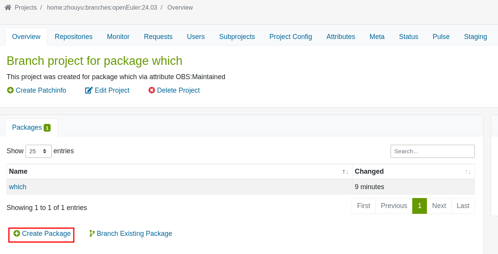
    填写信息；
    
6. 上传编写好的`_service`文件
    参考
    
    
    稍等后会自动开始构建；

## 发布

如果右侧软件包信息架构边上的图标为小推车，：

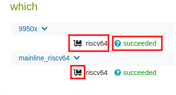


说明未进行发布操作，无法通过添加软件软后使用dnf或yum进行安装软件操作，需要进行发布。

1. 点击Repositories
    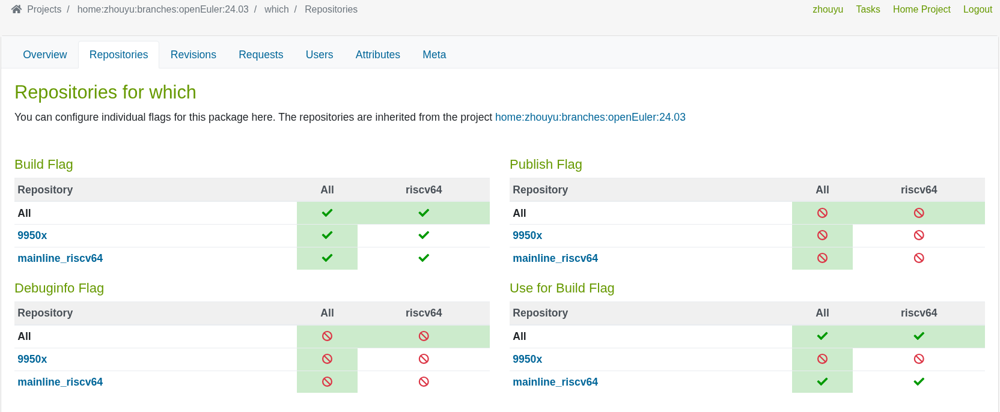
    
2. 注意Publish Flag,点击🚫图标，将其打开
    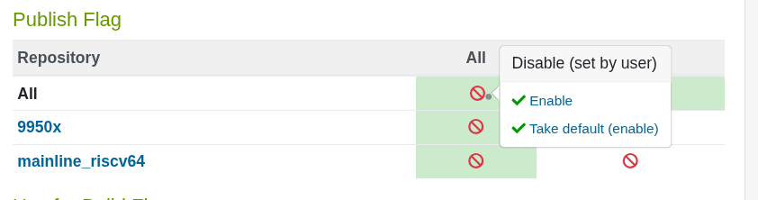
    此时：
    
    
    
    变为绿色货车，代表发布，可通过添加源后使用包管理器安装；
    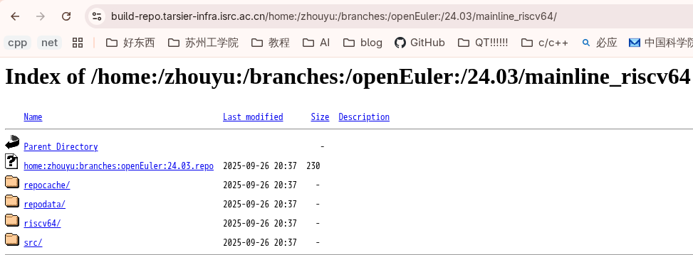

## 本地构建

#### 1、安装osc

如果发行版没有提供osc，则需要使用[源码](https://github.com/openSUSE/osc)进行编译安装；
fedora:`dnf install osc`;
arch:`pacman -S osc obs-build`。
安装完成后配置凭据：

```bash
mkdir .config/osc
vim .config/osc/oscrc
```

内容如下：

```
[general]
apiurl = https://build.tarsier-infra.isrc.ac.cn/                       no_verify  = 1      
[https://build.tarsier-infra.isrc.ac.cn/]   
user=xxxx             
pass=xxxx
```

#### 2、安装qemu user

fedora:`dnf install install qemu-user qemu-user-static-riscv -y`
arch:`pacman -S qemu qemu-user-static`

#### 3、本地构建

进入软件包页面：
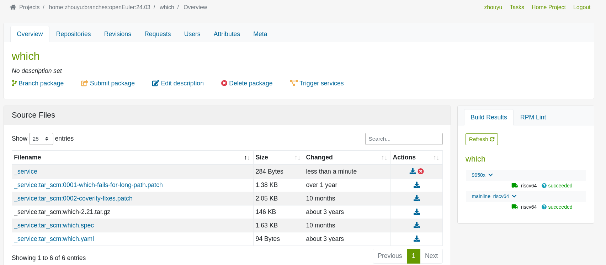
下载软件包信息到本地，使用命令:

```bash
osc co home:zhouyu:branches:openEuler:24.03/which
```


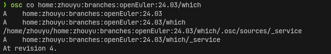
进入软件包所在目录，使用`osc up -S`将代码同步到本地
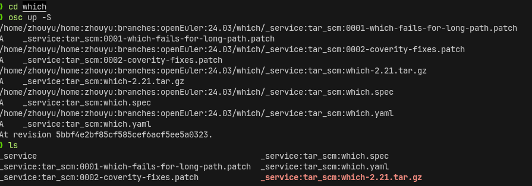
此时直接执行`osc build`会报错，需要将文件前的`_service:`删除：

```bash
for file in _service:*; do
  new_file="${file##*:}"
  mv -- "$file" "$new_file"
done
```

```bash
❯ ls   
0001-which-fails-for-long-path.patch  0002-coverity-fixes.patch  which.spec  which.yaml  which-2.21.tar.gz
```


回到工程类查看名称为`mainline_riscv64`,则编译命令为：

```bash
osc build mainline_riscv64 riscv64
```
