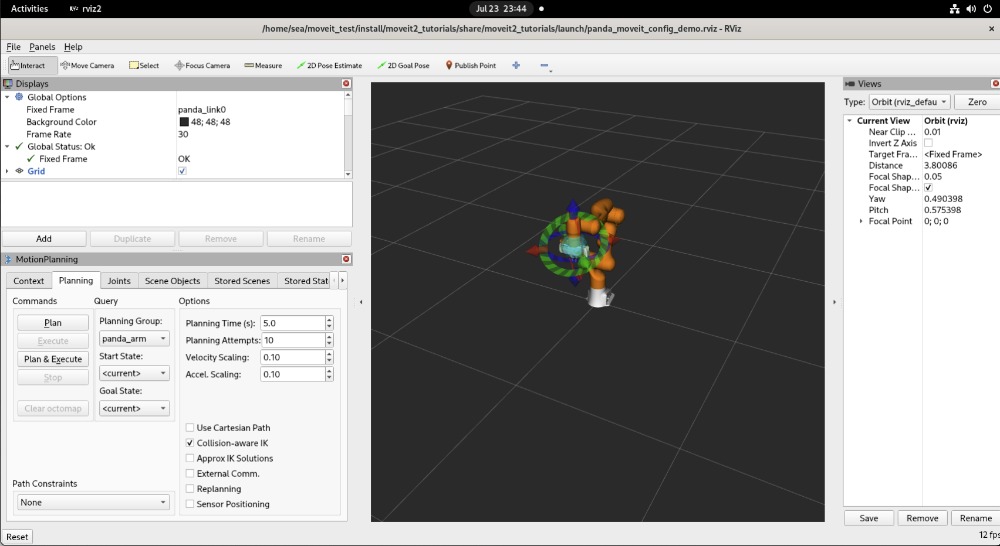
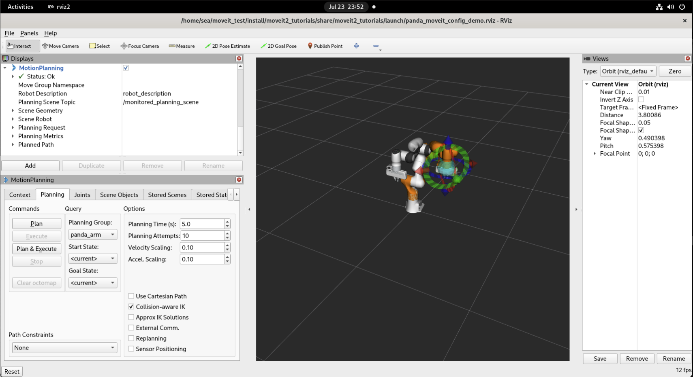
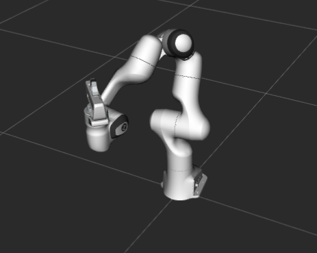
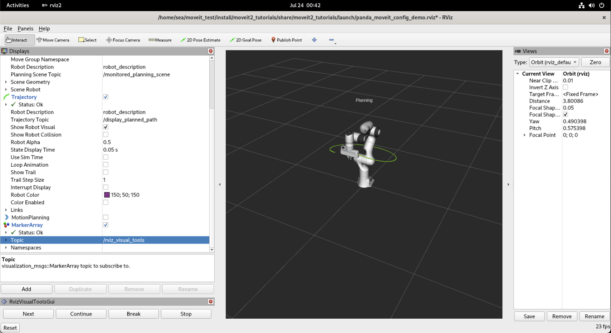
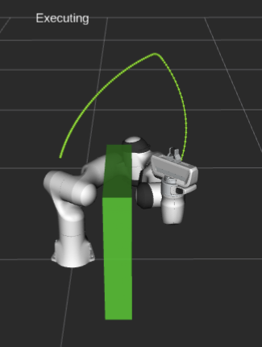

# 编译安装

1. 安装ROS Humble,如果未安装，参考[教程](https://openeuler-ros-docs.readthedocs.io/en/latest/installation/install-ros-humble.html)。安装`colcon`：`pip3 install -U pytest colcon-core colcon-common-extensions` 。如果使用`colcon build`命令报错找不到colcon，则在`.bashrc`文件中添加`export PATH=$HOME/.local/bin:$PATH`。
2. 选择从源码整体构建moveit2，否则会导致`moveit2_tutorials`教程无法复现。
3. 克隆`moveit2_tutorials`仓库及安装依赖。

    ```bash
    sudo yum install ros-humble-xacro ros-humble-ros-testing libcap-devel ros-humble-eigen-stl-containers ros-humble-warehouse-ros ros-humble-cv-bridge ros-humble-ompl ros-humble-angles ros-humble-moveit-msgs fcl fcl-devel ros-humble-generate-parameter-library ros-humble-geometric-shapes ros-humble-ruckig ros-humble-srdfdom ros-humble-backward-ros glew glew-devel freeglut-devel freeglut ros-humble-rviz-visual-tools ros-humble-graph-msgs
    ```

    ```bash
    # moveit_tutorials仓库
    mkdir -p ~/ws_moveit2/src
    cd ~/ws_moveit2/src
    git clone --branch humble https://github.com/ros-planning/moveit2_tutorials
    # 拉取依赖
    git clone https://github.com/ros-planning/moveit_task_constructor.git -b humble
    git clone https://github.com/PickNikRobotics/rosparam_shortcuts -b ros2
    git clone https://github.com/moveit/py_binding_tools -b ros2
    git clone https://github.com/PickNikRobotics/generate_parameter_library.git
    ```

    修改`moveit2_tutorials/doc/tutorials/pick_and_place_with_moveit_task_constructor/src/mtc_node.cpp`第123行`cartesian_planner->setMaxVelocityScalingFactor(1.0);`为`cartesian_planner->setMaxVelocityScaling(1.0);` ,124行`cartesian_planner->setMaxAccelerationScalingFactor(1.0);` 为`cartesian_planner->setMaxAccelerationScaling(1.0);`​

    修改`moveit2_tutorials/doc/tutorials/pick_and_place_with_moveit_task_constructor/src/minimal.cpp`第127行`cartesian_planner->setMaxVelocityScalingFactor(1.0);` 为`cartesian_planner->setMaxVelocityScaling(1.0);`,128行`setMaxAccelerationScalingFactor(1.0);` 为`setMaxAccelerationScaling(1.0);`​

    修改`moveit_task_constructor/visualization/motion_planning_tasks/properties/property_factory.cpp`第162行`rviz_common::properties::Property* result = new rviz::StringProperty`为`rviz_common::properties::Property* result = new rviz_common::properties::StringProperty` 。
4. 编译

    ```bash
    colcon build --symlink-install --cmake-args -DBUILD_TESTING=OFF -DCMAKE_CXX_FLAGS_RELEASE="-DBOOST_TIMER_ENABLE_DEPRECATED"
    ```

    如果有包编译时很久没成功，可以使用以下命令编译：

    ```bash
    colcon build --symlink-install --packages-select moveit_hybrid_planning moveit2_tutorials --cmake-args -DBUILD_TESTING=OFF -DCMAKE_CXX_FLAGS_RELEASE="-DBOOST_TIMER_ENABLE_DEPRECATED" -DCMAKE_EXE_LINKER_FLAGS='-fuse-ld=lld' -DCMAKE_SHARED_LINKER_FLAGS='-fuse-ld=lld'
    ```

# 入门

## 启动演示

使用以下命令启动moveit_tutorials的demo。

```bash
ros2 launch moveit2_tutorials demo.launch.py
```

如下图所示：



正常来说终端不会提示插件加载的报错,panda franka机械臂上也不会有红色的冲突标识。此时，可以拖动机械臂的末端。



点击左下角MotionPlanning面板中的Plan按钮，会有一个虚影展示机械臂所规划的移动路径，点击Execute，机械臂会移动至目标位置；点击plan&Execute同时执行规划及运动。

## 第一个C++ Moveit项目

创建工作空间，可以新建一个文件夹，也可以在ws_moveit中做。

```bash
cd your_workspace/src
ros2 pkg create \
 --build-type ament_cmake \
 --dependencies moveit_ros_planning_interface rclcpp \
 --node-name hello_moveit hello_moveit
```

编写`hello_moveit/src/hello_moveit.cpp`:

```cpp
#include <memory>

#include <rclcpp/rclcpp.hpp>
#include <moveit/move_group_interface/move_group_interface.h>


int main(int argc, char * argv[])
{
  // Initialize ROS and create the Node
  rclcpp::init(argc, argv);
  auto const node = std::make_shared<rclcpp::Node>(
    "hello_moveit",
    rclcpp::NodeOptions().automatically_declare_parameters_from_overrides(true)
  );

  // Create a ROS logger
  auto const logger = rclcpp::get_logger("hello_moveit");

  // Next step goes here

  // Create the MoveIt MoveGroup Interface
    using moveit::planning_interface::MoveGroupInterface;
    auto move_group_interface = MoveGroupInterface(node, "panda_arm");

    // Set a target Pose
    auto const target_pose = []{
    geometry_msgs::msg::Pose msg;
    msg.orientation.w = 1.0;
    msg.position.x = 0.28;
    msg.position.y = -0.2;
    msg.position.z = 0.5;
    return msg;
    }();
    move_group_interface.setPoseTarget(target_pose);

    // Create a plan to that target pose
    auto const [success, plan] = [&move_group_interface]{
    moveit::planning_interface::MoveGroupInterface::Plan msg;
    auto const ok = static_cast<bool>(move_group_interface.plan(msg));
    return std::make_pair(ok, msg);
    }();

    // Execute the plan
    if(success) {
    move_group_interface.execute(plan);
    } else {
    RCLCPP_ERROR(logger, "Planing failed!");
    }

  // Shutdown ROS
  rclcpp::shutdown();
  return 0;
}
```

使用`colcon build`编译。打开终端：

```bash
ros2 launch moveit2_tutorials demo.launch.py
```

打开新终端：

```bash
ros2 run hello_moveit hello_moveit
```

此时的机器人会处于下面的姿态：



## 在rviz中可视化

将此行添加到 `hello_moveit` 项目中的 `package.xml `中的其他`<depend>`语句之后：

```xml
<depend>moveit_visual_tools</depend>
```

然后在您的 `CMakeLists.txt` 中将此行添加到 `find_package` 语句部分：

```CMake
find_package(moveit_visual_tools REQUIRED)
```

在文件中进一步扩展 `ament_target_dependencies` 宏调用以包含新的依赖项，如下所示：

```CMake
ament_target_dependencies(
  hello_moveit
  "moveit_ros_planning_interface"
  "moveit_visual_tools" # 这句
  "rclcpp"
)
```

为了验证您是否正确添加了依赖项，请将所需的包含内容添加到源文件 `hello_moveit.cpp` 中：

```cpp
#include <moveit_visual_tools/moveit_visual_tools.h>
```

### 创建 ROS 执行器并在线程上旋转节点

在初始化 MoveItVisualTools 之前，我们需要在 ROS 节点上启动一个执行器。这是必要的，因为 MoveItVisualTools 需要与 ROS 服务和主题进行交互。

```cpp
#include <thread>  // <---- add this to the set of includes at the top

  ...

  // Create a ROS logger
  auto const logger = rclcpp::get_logger("hello_moveit");

  // We spin up a SingleThreadedExecutor so MoveItVisualTools interact with ROS
  rclcpp::executors::SingleThreadedExecutor executor;
  executor.add_node(node);
  auto spinner = std::thread([&executor]() { executor.spin(); });

  // Create the MoveIt MoveGroup Interface
  ...

  // Shutdown ROS
  rclcpp::shutdown();  // <--- This will cause the spin function in the thread to return
  spinner.join();  // <--- Join the thread before exiting
  return 0;
}
```

### 创建并初始化 MoveItVisualTools

在构造 MoveGroupInterface 之后构造并初始化 MoveItVisualTools。

```cpp
// Create the MoveIt MoveGroup Interface
using moveit::planning_interface::MoveGroupInterface;
auto move_group_interface = MoveGroupInterface(node, "panda_arm");

// Construct and initialize MoveItVisualTools
auto moveit_visual_tools = moveit_visual_tools::MoveItVisualTools{
    node, "panda_link0", rviz_visual_tools::RVIZ_MARKER_TOPIC,
    move_group_interface.getRobotModel()};
moveit_visual_tools.deleteAllMarkers();
moveit_visual_tools.loadRemoteControl();
```

将以下内容传入构造函数：ROS 节点、机器人的基链接、要使用的标记主题（稍后会详细介绍）以及机器人模型（我们从 move_group_interface 获取）。接下来，我们调用删除所有标记的功能。这将清除 RViz 中之前运行遗留的所有渲染状态。最后，我们加载远程控制插件。远程控制插件是一个非常简单的插件，它允许我们在 RViz 中使用一个按钮来与程序交互。

### 为可视化编写闭包

构建和初始化之后，我们现在创建一些闭包（可以访问当前范围内的变量的函数对象），稍后我们可以在程序中使用这些闭包来帮助在 RViz 中呈现可视化效果。

```cpp
// Create a closures for visualization
auto const draw_title = [&moveit_visual_tools](auto text) {
  auto const text_pose = [] {
    auto msg = Eigen::Isometry3d::Identity();
    msg.translation().z() = 1.0;
    return msg;
  }();
  moveit_visual_tools.publishText(text_pose, text, rviz_visual_tools::WHITE,
                                  rviz_visual_tools::XLARGE);
};
auto const prompt = [&moveit_visual_tools](auto text) {
  moveit_visual_tools.prompt(text);
};
auto const draw_trajectory_tool_path =
    [&moveit_visual_tools,
     jmg = move_group_interface.getRobotModel()->getJointModelGroup(
         "panda_arm")](auto const trajectory) {
      moveit_visual_tools.publishTrajectoryLine(trajectory, jmg);
    };
```

三个闭包都通过引用捕获 moveit_visual_tools ，最后一个闭包捕获指向我们正在规划的关节模型组对象的指针。它们每个都调用 moveit_visual_tools 上的一个函数，该函数会改变 RViz 中的某些内容。第一个 draw_title 在机器人底座上方一米处添加文本。这是一种从高层次展示程序状态的有效方法。第二个闭包调用一个名为 prompt 的函数。此函数会阻止您的程序，直到用户按下 RViz 中的 next 按钮。这有助于在调试时逐步执行程序。最后一个绘制了我们规划的轨迹的工具路径。这通常有助于从工具的角度理解规划的轨迹。

### 扩充中间代码

现在我们将扩充程序中间的代码。更新计划和执行代码，以包含以下新功能：

```cpp
// Set a target Pose
auto const target_pose = [] {
  geometry_msgs::msg::Pose msg;
  msg.orientation.w = 1.0;
  msg.position.x = 0.28;
  msg.position.y = -0.2;
  msg.position.z = 0.5;
  return msg;
}();
move_group_interface.setPoseTarget(target_pose);

// Create a plan to that target pose
prompt("Press 'Next' in the RvizVisualToolsGui window to plan");
draw_title("Planning");
moveit_visual_tools.trigger();
auto const [success, plan] = [&move_group_interface] {
  moveit::planning_interface::MoveGroupInterface::Plan msg;
  auto const ok = static_cast<bool>(move_group_interface.plan(msg));
  return std::make_pair(ok, msg);
}();

// Execute the plan
if (success) {
  draw_trajectory_tool_path(plan.trajectory_);
  moveit_visual_tools.trigger();
  prompt("Press 'Next' in the RvizVisualToolsGui window to execute");
  draw_title("Executing");
  moveit_visual_tools.trigger();
  move_group_interface.execute(plan);
} else {
  draw_title("Planning Failed!");
  moveit_visual_tools.trigger();
  RCLCPP_ERROR(logger, "Planing failed!");
}
```

每次调用 moveit_visual_tools 来更改 RViz 中渲染的内容后，都必须调用名为 trigger 的方法。这样做的原因是，发送到 RViz 的消息会被批量处理，并在调用 trigger 时发送，以减少标记主题的带宽占用。

### 完整代码

```cpp
#include <memory>
#include <rclcpp/rclcpp.hpp>
#include <moveit/move_group_interface/move_group_interface.h>
#include <moveit_visual_tools/moveit_visual_tools.h>
#include <thread>

int main(int argc, char * argv[])
{
  // Initialize ROS and create the Node
  rclcpp::init(argc, argv);
  auto const node = std::make_shared<rclcpp::Node>(
    "hello_moveit",
    rclcpp::NodeOptions().automatically_declare_parameters_from_overrides(true)
  );

  // Create a ROS logger
  auto const logger = rclcpp::get_logger("hello_moveit");
  // We spin up a SingleThreadedExecutor so MoveItVisualTools interact with ROS
  rclcpp::executors::SingleThreadedExecutor executor;
  executor.add_node(node);
  auto spinner = std::thread([&executor]() { executor.spin(); });


  // Next step goes here

  // Create the MoveIt MoveGroup Interface
    using moveit::planning_interface::MoveGroupInterface;
    auto move_group_interface = MoveGroupInterface(node, "panda_arm");

    // Construct and initialize MoveItVisualTools
    auto moveit_visual_tools = moveit_visual_tools::MoveItVisualTools{
        node, "panda_link0", rviz_visual_tools::RVIZ_MARKER_TOPIC,
        move_group_interface.getRobotModel()};
    moveit_visual_tools.deleteAllMarkers();
    moveit_visual_tools.loadRemoteControl();
    
      // Create a closures for visualization
    auto const draw_title = [&moveit_visual_tools](auto text) {
    auto const text_pose = [] {
        auto msg = Eigen::Isometry3d::Identity();
        msg.translation().z() = 1.0;
        return msg;
    }();
    moveit_visual_tools.publishText(text_pose, text, rviz_visual_tools::WHITE,
                                    rviz_visual_tools::XLARGE);
    };
    auto const prompt = [&moveit_visual_tools](auto text) {
    moveit_visual_tools.prompt(text);
    };
    auto const draw_trajectory_tool_path =
        [&moveit_visual_tools,
        jmg = move_group_interface.getRobotModel()->getJointModelGroup(
            "panda_arm")](auto const trajectory) {
        moveit_visual_tools.publishTrajectoryLine(trajectory, jmg);
        };

    // Set a target Pose
    auto const target_pose = [] {
    geometry_msgs::msg::Pose msg;
    msg.orientation.w = 1.0;
    msg.position.x = 0.28;
    msg.position.y = -0.2;
    msg.position.z = 0.5;
    return msg;
    }();
    move_group_interface.setPoseTarget(target_pose);

    // Create a plan to that target pose
    prompt("Press 'Next' in the RvizVisualToolsGui window to plan");
    draw_title("Planning");
    moveit_visual_tools.trigger();
    auto const [success, plan] = [&move_group_interface] {
    moveit::planning_interface::MoveGroupInterface::Plan msg;
    auto const ok = static_cast<bool>(move_group_interface.plan(msg));
    return std::make_pair(ok, msg);
    }();

    // Execute the plan
    if (success) {
    draw_trajectory_tool_path(plan.trajectory_);
    moveit_visual_tools.trigger();
    prompt("Press 'Next' in the RvizVisualToolsGui window to execute");
    draw_title("Executing");
    moveit_visual_tools.trigger();
    move_group_interface.execute(plan);
    } else {
    draw_title("Planning Failed!");
    moveit_visual_tools.trigger();
    RCLCPP_ERROR(logger, "Planing failed!");
    }

  // Shutdown ROS

  rclcpp::shutdown();
  spinner.join();
  return 0;
}
```

### 构建运行

使用`colcon build`编译。打开终端：

```bash
ros2 launch moveit2_tutorials demo.launch.py
```

取消勾选左侧面板中`MotionPlanning`,点击顶部菜单栏`Panels/Add New Panel`,选择`RvizVisualToolsGui` 。

打开新终端：

```bash
ros2 run hello_moveit hello_moveit
```

点击`next`，可以看到应用程序已完成规划，在机器人上方添加了标题，并绘制了一条表示工具路径的线。



## 围绕对象进行规划

在源文件的顶部，将其添加到包含列表中：

```cpp
#include <moveit/planning_scene_interface/planning_scene_interface.h>
```

### 改变目标姿势

```bash
// Set a target Pose
auto const target_pose = [] {
  geometry_msgs::msg::Pose msg;
  msg.orientation.w = 1.0;
  msg.position.x = 0.28;
  msg.position.y = 0.4;  // <---- This value was changed
  msg.position.z = 0.5;
  return msg;
}();
move_group_interface.setPoseTarget(target_pose);
```

### 创建碰撞对象

在下一个代码块中，我们创建一个碰撞对象。首先要注意的是，它被放置在机器人的框架内。如果我们有一个感知系统，可以报告场景中障碍物的位置，那么它就会构建这样的消息。由于这只是一个示例，因此我们手动创建它。在此代码块末尾需要注意的是，我们将此消息的操作设置为 ADD 。这会导致对象被添加到碰撞场景中。将此代码块放置在上一步设置目标姿势和创建计划之间。

```cpp
// Create collision object for the robot to avoid
auto const collision_object = [frame_id =
                                 move_group_interface.getPlanningFrame()] {
  moveit_msgs::msg::CollisionObject collision_object;
  collision_object.header.frame_id = frame_id;
  collision_object.id = "box1";
  shape_msgs::msg::SolidPrimitive primitive;

  // Define the size of the box in meters
  primitive.type = primitive.BOX;
  primitive.dimensions.resize(3);
  primitive.dimensions[primitive.BOX_X] = 0.5;
  primitive.dimensions[primitive.BOX_Y] = 0.1;
  primitive.dimensions[primitive.BOX_Z] = 0.5;

  // Define the pose of the box (relative to the frame_id)
  geometry_msgs::msg::Pose box_pose;
  box_pose.orientation.w = 1.0;
  box_pose.position.x = 0.2;
  box_pose.position.y = 0.2;
  box_pose.position.z = 0.25;

  collision_object.primitives.push_back(primitive);
  collision_object.primitive_poses.push_back(box_pose);
  collision_object.operation = collision_object.ADD;

  return collision_object;
}();
```

### 将对象添加到规划场景中

```cpp
// Add the collision object to the scene
moveit::planning_interface::PlanningSceneInterface planning_scene_interface;
planning_scene_interface.applyCollisionObject(collision_object);
```

### 完整代码

```cpp
#include <memory>
#include <rclcpp/rclcpp.hpp>
#include <moveit/move_group_interface/move_group_interface.h>
#include <moveit_visual_tools/moveit_visual_tools.h>
#include <thread>
#include <moveit/planning_scene_interface/planning_scene_interface.h>

int main(int argc, char * argv[])
{
  // Initialize ROS and create the Node
  rclcpp::init(argc, argv);
  auto const node = std::make_shared<rclcpp::Node>(
    "hello_moveit",
    rclcpp::NodeOptions().automatically_declare_parameters_from_overrides(true)
  );

  // Create a ROS logger
  auto const logger = rclcpp::get_logger("hello_moveit");
  // We spin up a SingleThreadedExecutor so MoveItVisualTools interact with ROS
  rclcpp::executors::SingleThreadedExecutor executor;
  executor.add_node(node);
  auto spinner = std::thread([&executor]() { executor.spin(); });


  // Next step goes here

  // Create the MoveIt MoveGroup Interface
    using moveit::planning_interface::MoveGroupInterface;
    auto move_group_interface = MoveGroupInterface(node, "panda_arm");

    // Construct and initialize MoveItVisualTools
    auto moveit_visual_tools = moveit_visual_tools::MoveItVisualTools{
        node, "panda_link0", rviz_visual_tools::RVIZ_MARKER_TOPIC,
        move_group_interface.getRobotModel()};
    moveit_visual_tools.deleteAllMarkers();
    moveit_visual_tools.loadRemoteControl();
    
      // Create a closures for visualization
    auto const draw_title = [&moveit_visual_tools](auto text) {
    auto const text_pose = [] {
        auto msg = Eigen::Isometry3d::Identity();
        msg.translation().z() = 1.0;
        return msg;
    }();
    moveit_visual_tools.publishText(text_pose, text, rviz_visual_tools::WHITE,
                                    rviz_visual_tools::XLARGE);
    };
    auto const prompt = [&moveit_visual_tools](auto text) {
    moveit_visual_tools.prompt(text);
    };
    auto const draw_trajectory_tool_path =
        [&moveit_visual_tools,
        jmg = move_group_interface.getRobotModel()->getJointModelGroup(
            "panda_arm")](auto const trajectory) {
        moveit_visual_tools.publishTrajectoryLine(trajectory, jmg);
        };

    // Set a target Pose
    auto const target_pose = [] {
    geometry_msgs::msg::Pose msg;
    msg.orientation.w = 1.0;
    msg.position.x = 0.28;
    msg.position.y = 0.4;
    msg.position.z = 0.5;
    return msg;
    }();
    move_group_interface.setPoseTarget(target_pose);

    // Create collision object for the robot to avoid
    auto const collision_object = [frame_id =
                                    move_group_interface.getPlanningFrame()] {
    moveit_msgs::msg::CollisionObject collision_object;
    collision_object.header.frame_id = frame_id;
    collision_object.id = "box1";
    shape_msgs::msg::SolidPrimitive primitive;

    // Define the size of the box in meters
    primitive.type = primitive.BOX;
    primitive.dimensions.resize(3);
    primitive.dimensions[primitive.BOX_X] = 0.5;
    primitive.dimensions[primitive.BOX_Y] = 0.1;
    primitive.dimensions[primitive.BOX_Z] = 0.5;

    // Define the pose of the box (relative to the frame_id)
    geometry_msgs::msg::Pose box_pose;
    box_pose.orientation.w = 1.0;
    box_pose.position.x = 0.2;
    box_pose.position.y = 0.2;
    box_pose.position.z = 0.25;

    collision_object.primitives.push_back(primitive);
    collision_object.primitive_poses.push_back(box_pose);
    collision_object.operation = collision_object.ADD;

    return collision_object;
    }();
    
    // Add the collision object to the scene
    moveit::planning_interface::PlanningSceneInterface planning_scene_interface;
    planning_scene_interface.applyCollisionObject(collision_object);

    // Create a plan to that target pose
    prompt("Press 'Next' in the RvizVisualToolsGui window to plan");
    draw_title("Planning");
    moveit_visual_tools.trigger();
    auto const [success, plan] = [&move_group_interface] {
    moveit::planning_interface::MoveGroupInterface::Plan msg;
    auto const ok = static_cast<bool>(move_group_interface.plan(msg));
    return std::make_pair(ok, msg);
    }();

    // Execute the plan
    if (success) {
    draw_trajectory_tool_path(plan.trajectory_);
    moveit_visual_tools.trigger();
    prompt("Press 'Next' in the RvizVisualToolsGui window to execute");
    draw_title("Executing");
    moveit_visual_tools.trigger();
    move_group_interface.execute(plan);
    } else {
    draw_title("Planning Failed!");
    moveit_visual_tools.trigger();
    RCLCPP_ERROR(logger, "Planing failed!");
    }

  // Shutdown ROS

  rclcpp::shutdown();
  spinner.join();
  return 0;
}
```

### 运行并观察

使用`colcon build`编译。打开终端：

```bash
ros2 launch moveit2_tutorials demo.launch.py rviz_config:=panda_hello_moveit.rviz
```

取消勾选左侧面板中`MotionPlanning`,点击顶部菜单栏`Panels/Add New Panel`,选择`RvizVisualToolsGui` 。

打开新终端：

```bash
ros2 run hello_moveit hello_moveit
```




‍
