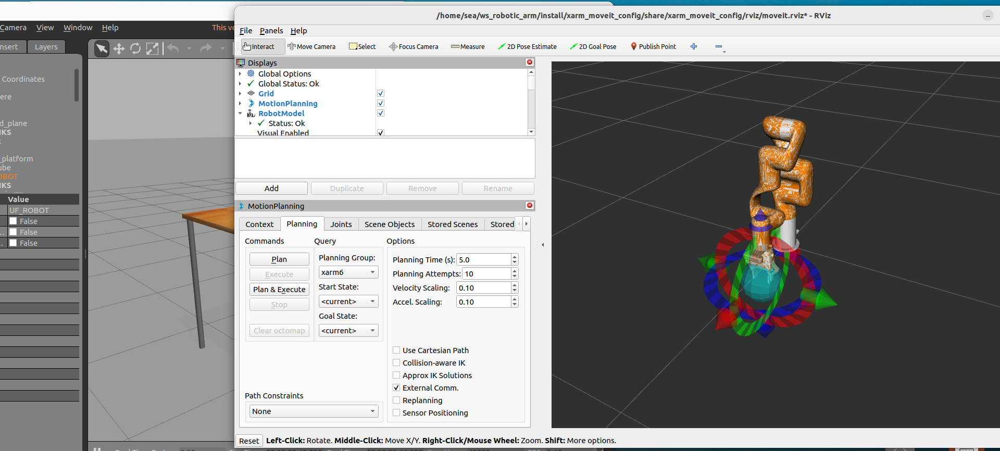

# 机械臂视觉抓取

使用UFACTORY xArm 系列的仿真模型。

## 编译安装xarm_ros2

```bash
mkdir -p dev_ws/src
cd ~/dev_ws/src
git clone https://github.com/xArm-Developer/xarm_ros2.git --recursive -b $ROS_DISTRO
rosdep update
rosdep install --from-paths . --ignore-src --rosdistro $ROS_DISTRO -y
cd ~/dev_ws/
colcon build
cd ~/dev_ws/
source install/setup.bash
```

## 使用

使用`ros2 launch xarm_moveit_config xarm6_moveit_gazebo.launch.py `命令启动gazebo仿真以及moveit。

为了在启动机械臂时安装夹爪以及深度相机，在启动时加上参数`ros2 launch xarm_moveit_config xarm6_moveit_gazebo.launch.py add_realsense_d435i:=true add_gripper:=true`



## 具体实现

### 仿真平台环境搭建

为了实现抓取任务，修改`xarm_ros2/xarm_gazebo/worlds/`目录中的`table.world`,在其中桌子前加上白色平台，在白色平台上放置红色方块用于抓取。具体代码见[table.world](../../src/xarm_ros2/xarm_gazebo/worlds/table.world)。

### 视觉处理

使用`ros2 run rqt_image_view rqt_image_view`查看相机所发布的话题，`/color/image_raw`包含色彩信息，`/aligned_depth_to_color/image_raw`包很深度信息，编写视觉处理节点时需订阅这两个话题。

编写节点[vision_node](../../src/xarm_vision_grasp/src/vision_node.cpp)，步骤如下

| 步骤                     | 说明                                           |
| ------------------------ | ---------------------------------------------- |
| 订阅彩色和深度图像       | 获取实时图像数据                               |
| 颜色空间转换             | 将彩色图像转到HSV空间，方便颜色阈值分割        |
| 红色区域提取             | 通过阈值分割得到红色区域的二值掩码             |
| 形态学处理               | 降噪，去除小区域                               |
| 轮廓检测                 | 找出所有红色区域轮廓                           |
| 选取最大轮廓             | 假设最大轮廓为目标物                           |
| 质心计算                 | 计算物体中心点像素坐标                         |
| 深度图读取深度值         | 根据质心像素坐标获取深度图对应点的深度值       |
| 像素坐标转相机坐标系坐标 | 利用相机内参计算物体三维坐标                   |
| 发布三维点               | 将物体的三维位置发布到`red_block_position`话题 |
| 日志打印                 | 输出检测结果，方便调试                         |

### 控制节点

为方便控制，自定义一个服务类型[`Grasp.srv'](../../src/xarm_vision_grasp/srv/Grasp.srv)，内容如下：

```srv
geometry_msgs/PoseStamped target_pose
---
bool success
string message
```

编写[contol_node](../../src/xarm_vision_grasp/src/control_node.cpp)，订阅视觉节点发布的红色方块位置，通过终端交互等待用户是否执行抓取任务，用户确认后，调用名为`grasp_service`的服务，发送目标位姿。

### 机械臂控制节点

编写[arm_control_node](../../src/xarm_vision_grasp/src/arm_control_node.cpp)提供抓取服务，接收抓取目标的位姿，转换坐标系，控制夹爪。

### 启动

依次打开终端，启动节点

```bash
ros2 launch xarm_moveit_config xarm6_moveit_gazebo.launch.py add_realsense_d435i:=true add_gripper:=true
ros2 run xarm_vision_grasp vision_node 
ros2 run xarm_vision_grasp control_node
```

