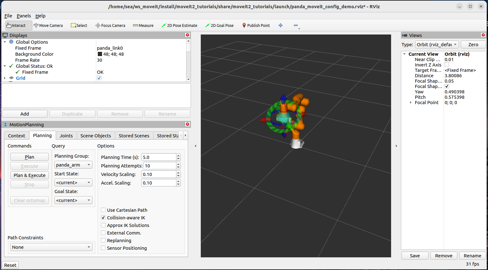

# RViz 中的 MoveIt 快速入门

## 步骤 1：启动演示并配置插件

启动演示：

```
ros2 launch moveit2_tutorials demo.launch.py
```

如下图所示：



此时可参考[教程](https://moveit.picknik.ai/main/doc/tutorials/quickstart_in_rviz/quickstart_in_rviz_tutorial.html)设置rviz相关内容。