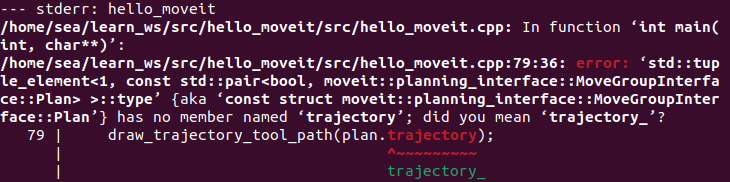

# 在rviz中可视化

## 1 添加依赖 moveit_visual_tools

### 配置package.xml文件

在`hello_moveit`项目的`package.xml`文件中添加以下依赖项（位于其他`<depend>`标签之后）：

```xml
<depend>moveit_visual_tools</depend>
```

### 修改CMakeLists.txt

在`CMakeLists.txt`文件中进行三处修改：

```cmake
# 在find_package部分添加
find_package(moveit_visual_tools REQUIRED)

# 在ament_target_dependencies中添加依赖
ament_target_dependencies(
  hello_moveit
  "moveit_ros_planning_interface"
  "moveit_visual_tools"  # 新增可视化工具依赖
  "rclcpp"
)
```

在源文件 `hello_moveit.cpp` 中添加：

```
#include <moveit_visual_tools/moveit_visual_tools.h>
```

为了测试这一切是否有效，请在工作区目录中打开一个终端（记住在 opt 中获取 ROS 安装的源代码），然后使用 colcon 进行构建：

```bash
cd ~/ws_moveit
colcon build --mixin debug
```

## 2 创建ROS执行器与线程管理

### 添加头文件

在`hello_moveit.cpp`顶部添加线程支持：

```cpp
#include <thread> 
```

接下来，在创建 MoveIt MoveGroup 接口之前添加执行器。

### 初始化执行器

在创建MoveGroupInterface之前添加执行器：

```cpp
  // Spin up a SingleThreadedExecutor for MoveItVisualTools to interact with ROS
  rclcpp::executors::SingleThreadedExecutor executor;
  executor.add_node(node);
  auto spinner = std::thread([&executor]() { executor.spin(); });

  // Create the MoveIt MoveGroup Interface
...
```

### 线程回收

在程序退出前添加清理代码：

```cpp
rclcpp::shutdown();  // 终止ROS通信
spinner.join();      // 等待线程结束
return 0;
```

进行这些更改后，重建工作区以确保没有任何语法错误。

## 3 初始化MoveIt可视化工具

### 核心初始化代码

在创建MoveGroupInterface之后添加：

```cpp
// Create the MoveIt MoveGroup Interface
using moveit::planning_interface::MoveGroupInterface;
auto move_group_interface = MoveGroupInterface(node, "manipulator");

// Construct and initialize MoveItVisualTools
auto moveit_visual_tools = moveit_visual_tools::MoveItVisualTools{
    node, "base_link", rviz_visual_tools::RVIZ_MARKER_TOPIC,
    move_group_interface.getRobotModel()};
moveit_visual_tools.deleteAllMarkers();
moveit_visual_tools.loadRemoteControl();
```

*参数说明*：

- `base_link`：可视化元素的参考坐标系
- `RVIZ_MARKER_TOPIC`：默认使用`/rviz_visual_tools`话题通信
- `getRobotModel()`：获取当前机器人URDF模型

## 4 创建可视化辅助函数

### 定义三个闭包函数

```
// Create closures for visualization
auto const draw_title = [&moveit_visual_tools](auto text) {
  auto const text_pose = [] {
    auto msg = Eigen::Isometry3d::Identity();
    msg.translation().z() = 1.0;  // Place text 1m above the base link
    return msg;
  }();
  moveit_visual_tools.publishText(text_pose, text, rviz_visual_tools::WHITE,
                                  rviz_visual_tools::XLARGE);
};
auto const prompt = [&moveit_visual_tools](auto text) {
  moveit_visual_tools.prompt(text);
};
auto const draw_trajectory_tool_path =
    [&moveit_visual_tools,
     jmg = move_group_interface.getRobotModel()->getJointModelGroup(
         "manipulator")](auto const trajectory) {
      moveit_visual_tools.publishTrajectoryLine(trajectory, jmg);
    };
```

*功能说明*：

1. `draw_title`：用于显示当前步骤的状态（如"Planning"）,在机器人底座上方一米处添加文本。这是一种从高层次展示程序状态的有用方法。
2. `prompt`：实现分步调试，此函数会阻止您的程序，直到用户按下 RViz 中的 `next` 按钮。这对于在调试时逐步执行程序很有帮助。
3. `draw_trajectory`：将规划路径转化为可视化的彩色线条,绘制了我们规划的轨迹的刀具路径。

## 5 集成可视化到运动规划

### 增强规划执行代码

```
// Set a target Pose
auto const target_pose = [] {
  geometry_msgs::msg::Pose msg;
  msg.orientation.w = 1.0;
  msg.position.x = 0.28;
  msg.position.y = -0.2;
  msg.position.z = 0.5;
  return msg;
}();
move_group_interface.setPoseTarget(target_pose);

// Create a plan to that target pose
prompt("Press 'Next' in the RvizVisualToolsGui window to plan");
draw_title("Planning");
moveit_visual_tools.trigger();
auto const [success, plan] = [&move_group_interface] {
  moveit::planning_interface::MoveGroupInterface::Plan msg;
  auto const ok = static_cast<bool>(move_group_interface.plan(msg));
  return std::make_pair(ok, msg);
}();

// Execute the plan
if (success) {
  draw_trajectory_tool_path(plan.trajectory);
  moveit_visual_tools.trigger();
  prompt("Press 'Next' in the RvizVisualToolsGui window to execute");
  draw_title("Executing");
  moveit_visual_tools.trigger();
  move_group_interface.execute(plan);
} else {
  draw_title("Planning Failed!");
  moveit_visual_tools.trigger();
  RCLCPP_ERROR(logger, "Planning failed!");
}
```

*关键点说明*：

- `trigger()`：批量发送可视化消息，优化通信效率
- `plan()`：返回包含成功标志和路径的元组
- 三维坐标值可根据实际机械臂工作空间调整

最后，再次构建您的项目以确保所有代码添加都是正确的。

```
colcon build --mixin debug
```

如遇到如下图所示的报错：



将代码中`draw_trajectory_tool_path(plan.trajectory);`更改为`draw_trajectory_tool_path(plan.trajectory_);`

## 6 在 RViz 中启用可视化 

新建终端1并打开rviz演示启动文件：

```bash
ros2 launch moveit2_tutorials demo.launch.py
```

取消选中“Displays”选项卡中的“MotionPlanning”以将其隐藏。要添加按钮来与我们添加到程序中的提示进行交互，请使用“面板/添加新面板”菜单打开对话框，

然后选择 `RvizVisualToolsGui` 并单击 OK。这将在左下角创建一个新面板，其中有一个我们稍后会使用的 `Next` 按钮。最后，我们需要添加 `Marker Array` 来呈现我们添加的可视化效果。单击“显示”面板中的“添加”按钮。选择 `Marker Array` 并单击 `OK` 。滚动到显示面板中项目的底部，然后将新标记阵列正在使用的主题编辑为 `/rviz_visual_tools` 。

## 7 运行程序

```bash
ros2 run hello_moveit hello_moveit
```

