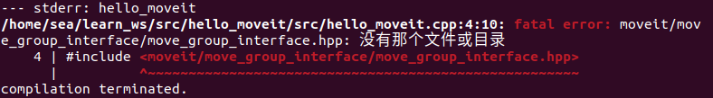
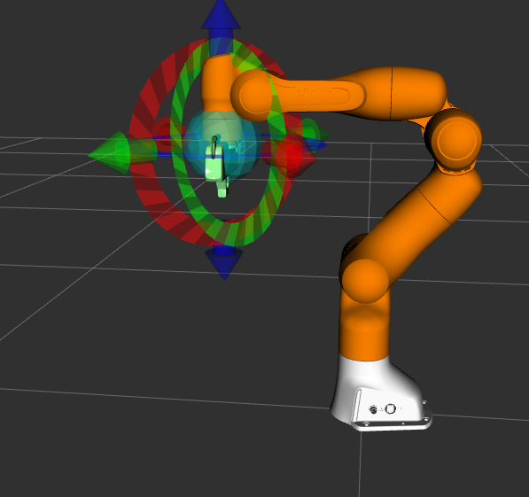
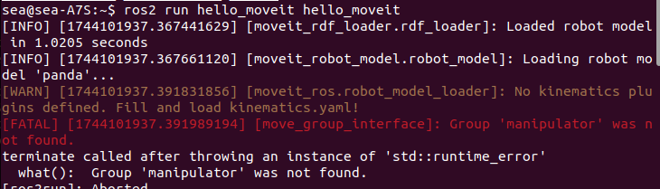
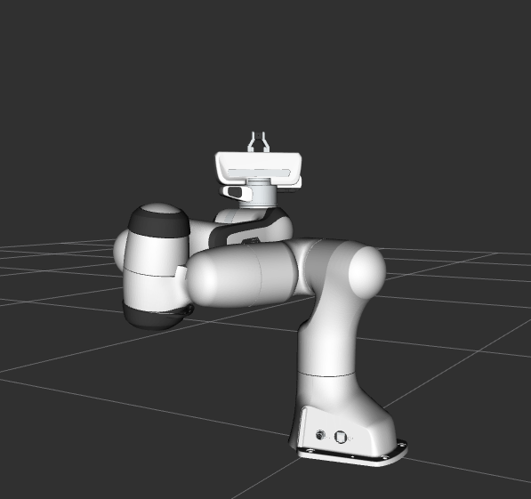

# 第一个 C++ MoveIt 项目

## 1 创建包

导航到工作空间的src目录。

使用 ROS 2 命令行工具创建一个新包：

```bash
ros2 pkg create \
 --build-type ament_cmake \
 --dependencies moveit_ros_planning_interface rclcpp \
 --node-name hello_moveit hello_moveit
```

## 2 创建 ROS 节点和执行器 

```cpp
#include <memory>

#include <rclcpp/rclcpp.hpp>
#include <moveit/move_group_interface/move_group_interface.hpp>

int main(int argc, char * argv[])
{
  // Initialize ROS and create the Node
  rclcpp::init(argc, argv);
  auto const node = std::make_shared<rclcpp::Node>(
    "hello_moveit",
    rclcpp::NodeOptions().automatically_declare_parameters_from_overrides(true)
  );

  // Create a ROS logger
  auto const logger = rclcpp::get_logger("hello_moveit");

  // Next step goes here

  // Shutdown ROS
  rclcpp::shutdown();
  return 0;
}
```

### 2.1 构建并运行

将目录更改回工作区目录 `learn_moveit_ws` 并运行以下命令：

```
cd ..
colcon build --mixin debug
```

编译时可能会报错：

将开头头文件中的move_group_interface.hpp改为move_group_interface.h。

运行你的程序并查看输出。

```bash
ros2 run hello_moveit hello_moveit
```

程序应该运行并退出并且没有错误。

### 2.2 检查代码

顶部包含的头文件是一些标准 C++ 标头和我们稍后将使用的 ROS 和 MoveIt 的标头。之后，我们通过正常调用来初始化 rclcpp，然后创建我们的 Node。

```
auto const node = std::make_shared<rclcpp::Node>(
  "hello_moveit",
  rclcpp::NodeOptions().automatically_declare_parameters_from_overrides(true)
);
```

创建一个新的 ROS 2 节点，名称为 `"hello_moveit"`。这是该节点在 ROS 2 网络中的唯一标识。MoveIt 需要第二个参数，因为我们使用 ROS 参数的方式不同。
接下来，我们[创建一个名为“hello_moveit”的记录器，](https://docs.ros.org/en/humble/Tutorials/Demos/Logging-and-logger-configuration.html) 以使我们的日志输出保持有序和可配置。

```
// Create a ROS logger
auto const logger = rclcpp::get_logger("hello_moveit");
```

最后，我们有关闭 ROS 的代码。

```
// Shutdown ROS
rclcpp::shutdown();
return 0;
```

## 3 使用 MoveGroupInterface 进行计划和执行

在“Next step goes here”的注释位置添加以下代码：

```cpp
// Create the MoveIt MoveGroup Interface
using moveit::planning_interface::MoveGroupInterface;
auto move_group_interface = MoveGroupInterface(node, "manipulator");

// Set a target Pose
auto const target_pose = []{
  geometry_msgs::msg::Pose msg;
  msg.orientation.w = 1.0;
  msg.position.x = 0.28;
  msg.position.y = -0.2;
  msg.position.z = 0.5;
  return msg;
}();
move_group_interface.setPoseTarget(target_pose);

// Create a plan to that target pose
auto const [success, plan] = [&move_group_interface]{
  moveit::planning_interface::MoveGroupInterface::Plan msg;
  auto const ok = static_cast<bool>(move_group_interface.plan(msg));
  return std::make_pair(ok, msg);
}();

// Execute the plan
if(success) {
  move_group_interface.execute(plan);
} else {
  RCLCPP_ERROR(logger, "Planning failed!");
}
```

### 3.1 构建并运行 

在工作区目录中，运行以下命令：

```bash
colcon build --mixin debug
```

在新的终端1中启动rviz和movegroup节点。

```bash
ros2 launch moveit2_tutorials demo.launch.py
```

目前机械臂姿态如下图：



在新的终端2中运行:

```bash
ros2 run hello_moveit hello_moveit
```

此时报错如下图：



修改代码中的`auto move_group_interface = MoveGroupInterface(node, "manipulator");`部分为  `auto move_group_interface = MoveGroupInterface(node, "panda_arm");`并重新编译。

代码执行后，机械臂状态如下图：



### 3.2 检查代码

我们要做的第一件事是创建 `MoveGroupInterface` 。此对象将用于与 `move_group` 交互，这使我们能够规划和执行轨迹。请注意，这是我们在此程序中创建的唯一可变对象。另一件需要注意的事情是我们在此处创建的 `MoveGroupInterface` 对象的第二个参数： `"manipulator"` 。这是机器人描述中定义的关节组，我们将使用此 `MoveGroupInterface` 对其进行操作。

```c++
using moveit::planning_interface::MoveGroupInterface;
auto move_group_interface = MoveGroupInterface(node, "manipulator");
```

然后，我们设置目标姿势和计划。请注意，仅设置目标姿势（通过 `setPoseTarget` ）。

`orientation.w = 1.0` 表示四元数的角度，通常 `w = 1` 时表示没有旋转（单位四元数）。

`position.x`, `position.y`, `position.z` 设置了目标位置的三维坐标。

```cpp
// Set a target Pose
auto const target_pose = []{
  geometry_msgs::msg::Pose msg;
  msg.orientation.w = 1.0;
  msg.position.x = 0.28;
  msg.position.y = -0.2;
  msg.position.z = 0.5;
  return msg;
}();
move_group_interface.setPoseTarget(target_pose);

// Create a plan to that target pose
auto const [success, plan] = [&move_group_interface]{
  moveit::planning_interface::MoveGroupInterface::Plan msg;
  auto const ok = static_cast<bool>(move_group_interface.plan(msg));
  return std::make_pair(ok, msg);
}();
```

最后，如果规划成功，我们就执行计划，否则，我们就记录错误：

```cpp
// Execute the plan
if(success) {
  move_group_interface.execute(plan);
} else {
  RCLCPP_ERROR(logger, "Planning failed!");
}
```